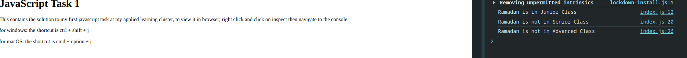

# JavaScript Task 1

This contains the solution to my first javascript task at my applied learning cluster

## Table of Contents
- [Overview](#overview)
- [Features](#features)
- [Technologies Used](#technologies-used)
- [Screenshots](#screenshots)
- [Get in Touch](#get-in-touch)

## Overview

The logic assigns a student to a specific class (Junior, Senior, or Advanced) based on their age and student status. It checks the student's age and student status and logs whether they belong to a certain class or not.

## Features

- Checks the student's age and status.
- Assigns the student to one of the following classes:
   - Junior Class (if the student is under 18 years old).
   - Senior Class (if the student is exactly 18 years old).
   - Advanced Class (if the student is between 19 and 25 years old).
   - Logs whether the student does or does not belong to any class.

## Technologies Used

- HTML5
- JavaScript

## Screenshots
### Console View:

## Get in Touch

 You can reach out to me;
 - Linkedin- [Morufat-Lamidi](https://linkedin.com/in/morufat-lamidi)
 - Frontend Mentor - [@Ehmkayel](https://www.frontendmentor.io/profile/Ehmkayel)
 - Twitter - [@kamalehmk](https://www.twitter.com/kamalehmk)
 - Gmail- [Mail](mailto:lamidimorufat0@gmail.com);