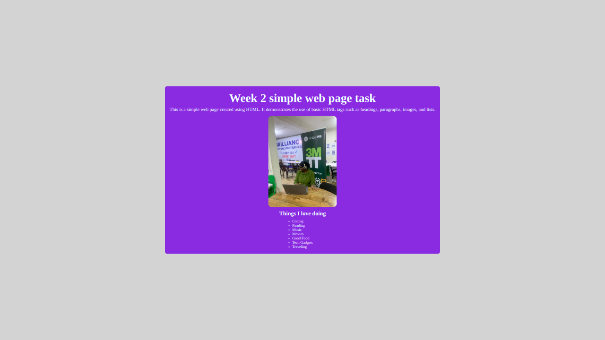
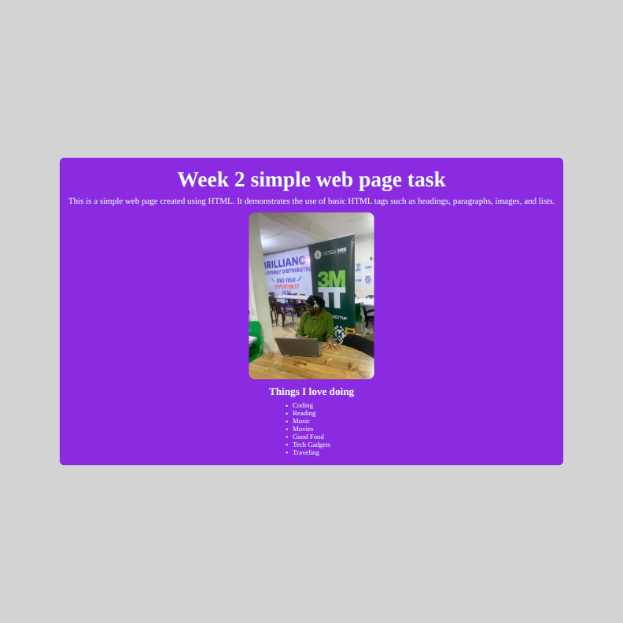
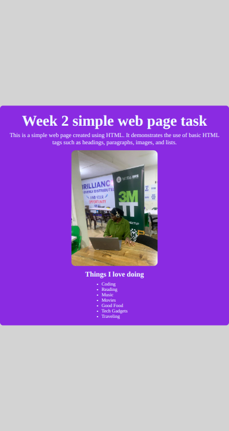

# Week 2 - Simple Web Page Task

This project is a simple web page using basic HTML and CSS. It includes a header, a paragraph, an image, and a list, with all content centered on the page both horizontally and vertically.

## Table of Contents
- [Overview](#overview)
- [Features](#features)
- [Technologies Used](#technologies-used)
- [How to Run](#how-to-run)
- [Project Structure](#project-structure)
- [Screenshots](#screenshots)
- [Get in Touch](#get-in-touch)

## Overview


This project was developed as part of Week 2 tasks. The goal was to practice basic web development concepts like structuring HTML, styling with CSS. The web page includes elements such as:

- A heading
- A paragraph
- An image
- An unordered list of things I love doing

## Features

- Responsive layout with Flexbox.
- Image sizing that prevents stretching.
- All contents are centered on the page.
- Simple, clean design with minimal styling.

## Technologies Used

- **HTML5**: To structure the content of the web page.
- **CSS3**: For styling the web page

## How to Run

1. Download or clone the repository.

- Clone the repository:
    ```bash
    git clone 
    ```
- Navigate to the project folder:
    ```bash
    cd Week 2
    ```

2. Open the `index.html` file in any web browser to view the webpage.

- Open the `index.html` file in a browser:
    ```bash
    open index.html
    ```

## Project Structure
The project consists of the following files:
Week 2/ │ 
├── index.html 
├── style.css 
├── Screenshot
└── readme.md 

## Screenshots

### Desktop View:



### Laptop View:


### Tablet View:


### Mobile View:


## Get in Touch

 You can reach out to me;
 - Linkedin- [Morufat-Lamidi](https://linkedin.com/in/morufat-lamidi)
 - Frontend Mentor - [@Ehmkayel](https://www.frontendmentor.io/profile/Ehmkayel)
 - Twitter - [@kamalehmk](https://www.twitter.com/kamalehmk)
 - Gmail- [Mail](mailto:lamidimorufat0@gmail.com);