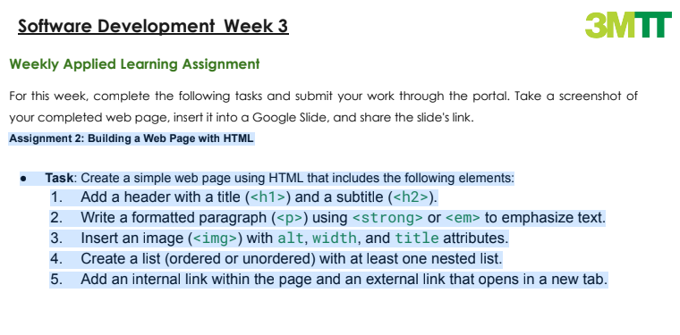
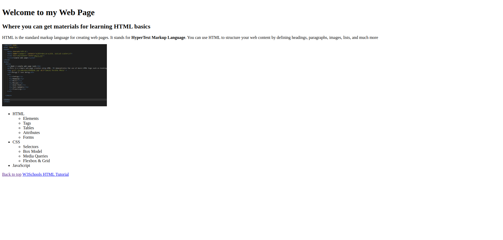

# Assignment 2: Building a Simple Web Page with HTML

This project is a basic web page using fundamental HTML elements. The web page includes a header, paragraph with strong text, an image, a nested list, and both internal and external links.

## Table of Contents
- [Overview](#overview)
- [Features](#features)
- [Technologies Used](#technologies-used)
- [How to Run](#how-to-run)
- [Screenshots](#screenshots)
- [Get in Touch](#get-in-touch)


## Overview



The objective of this project is to practice working with basic HTML tags and create a functional web page. This page includes a header, a formatted paragraph with bold text, an image with appropriate attributes, a nested list, and links for navigation.

## Features
- Header with a title and subtitle.
- Paragraph with bold text
- Image with alt, width, and title attributes.
- Unordered list with a nested sublist.
- Internal link for navigating within the page.
- External link that opens in a new tab.

## Technologies Used

- **HTML5**

## How to Run
1. Download or clone the repository.


- Clone the repository:
    ```bash
    git clone 
    ```
- Navigate to the project folder:
    ```bash
    cd Week 3
    ```

2. Open the `index.html` file in any web browser to view the webpage.

- Open the `index.html` file in a browser:
    ```bash
    open index.html
    ```

## Screenshots

### Web Page View


## Get in Touch

 You can reach out to me;
 - Linkedin- [Morufat-Lamidi](https://linkedin.com/in/morufat-lamidi)
 - Frontend Mentor - [@Ehmkayel](https://www.frontendmentor.io/profile/Ehmkayel)
 - Twitter - [@kamalehmk](https://www.twitter.com/kamalehmk)
 - Gmail- [Mail](mailto:lamidimorufat0@gmail.com);